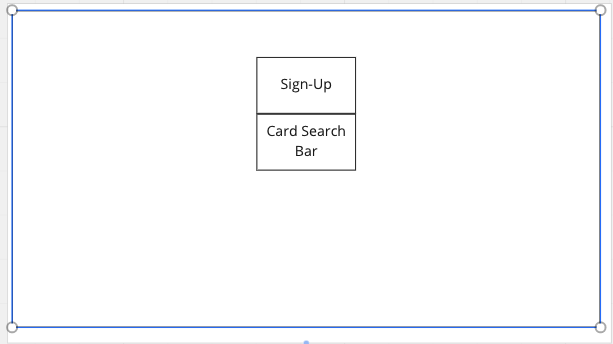
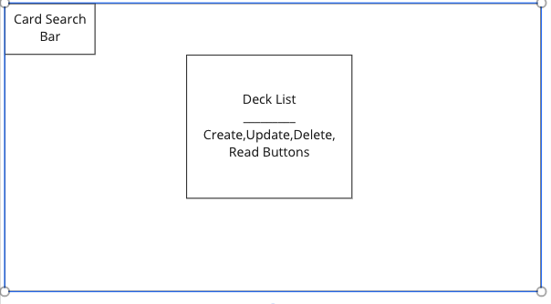
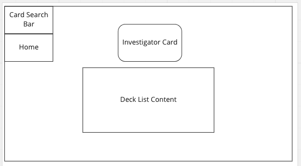
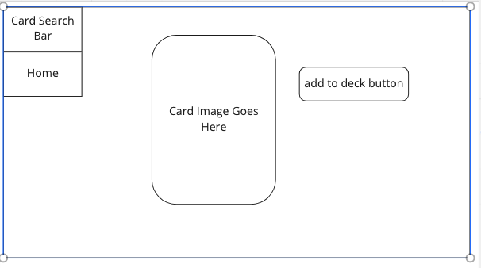
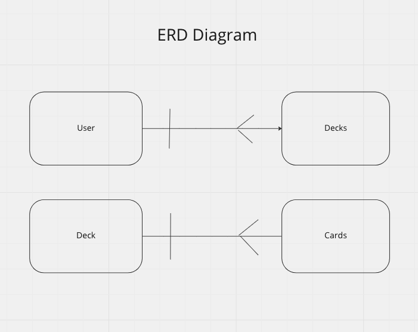

Arkham Horror LCG Deck Manager
==============================

This is the planning documentation for my Arkham Horror Deck manager. 
The list below will include the necessities for starting my project. 

1. User Stories for the MVP
2. Wireframes for each page of my appliction 
3. An ERD list with a breakdown of the attributes on each entity along with a diagrams for the relationships
4. User Stories for versions 2 and 3

MVP User Stories
----------------

As a User I want...

- to be able to sign in and see my decks
- to be able to search for cards by parameters 
- to be able to CRUD a deck
- to be able to add or remove cards from a deck

Wireframes
-----------------

The Login Page 


The Home Page 


The Deck Page


The Card Page


ERD Breakdown 
---------------------

My application will have 3 data entries. 


1. Decks
```
{
    Deck :{
        name: String
    },
    {
        Investigator: String
    },
    {
        XP : Number
    },
    {
        Cards : {Cards}
    }
}
```
2. Cards
```
{
    Card :{
        name: String
    },
    {
        text: String
    },
    {
        image : String
    },
    
}
```

3. Users

```
{
    User :{
        email: String
    },
    {
        password: String
    },
    {
        Decks : {Decks}
    },
    
}
```

**User has a One to Many relationship with Decks**

**Deck has a One to Many relationship with Cards**



Next Versions
-------------

Version 2 
1. Users will have access to all the card sets
2. Users will be able to CRUD a campaign entity

Version 3
1. Users will be able to send deck lists to one another
2. Users will only be able to add a card that is allowed by the rules